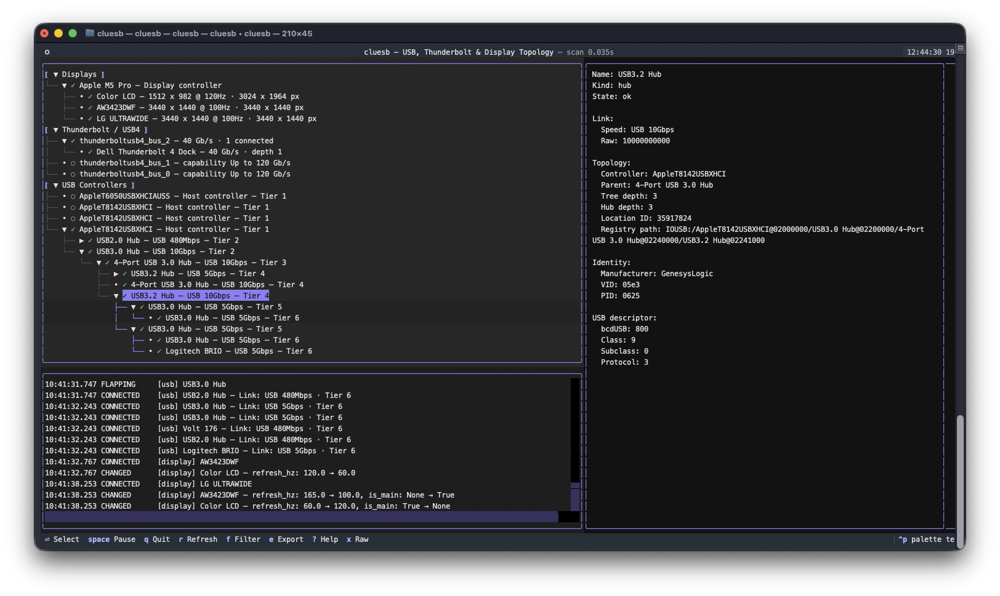

# cluesb

I built `cluesb` after spending too much time trying to work out what was
actually happening in my work-from-home setup. Between USB hubs, a Thunderbolt
dock, a KVM, displays, and a pile of peripherals, macOS had the information I
needed—but it was scattered across several tools and not especially easy to
follow.

`cluesb` brings that information into one live terminal view. It shows USB
controllers, hubs, and devices; Thunderbolt/USB4 paths; connected displays;
negotiated link speeds; USB tiers; diagnostic hints; and a history of connects,
disconnects, and other changes. It is a macOS-only tool, uses the system's
built-in diagnostics without `sudo`, and runs as an interactive TUI or a
one-shot CLI report.

It sticks to evidence macOS actually reports. If a display route cannot be
resolved, or a slower link might have several causes, `cluesb` says so instead
of declaring that a cable, hub, KVM, or device is broken.



## CLI

```console
cluesb
cluesb --interval 0.5
cluesb --once
cluesb --json
cluesb --json --redact
cluesb --debug --once
cluesb --help
```

- `cluesb` opens the interactive TUI.
- `--interval` sets the refresh interval from 0.1 to 10 seconds.
- `--once` prints a readable topology snapshot and exits.
- `--json` prints a machine-readable snapshot and exits.
- `--redact` hashes serial numbers before JSON output is shared.
- `--debug` writes collector commands, timings, and warnings to stderr.
